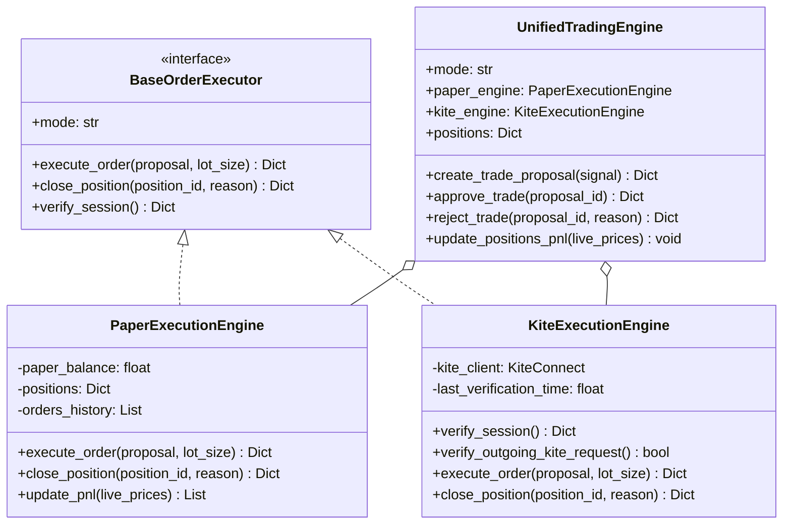
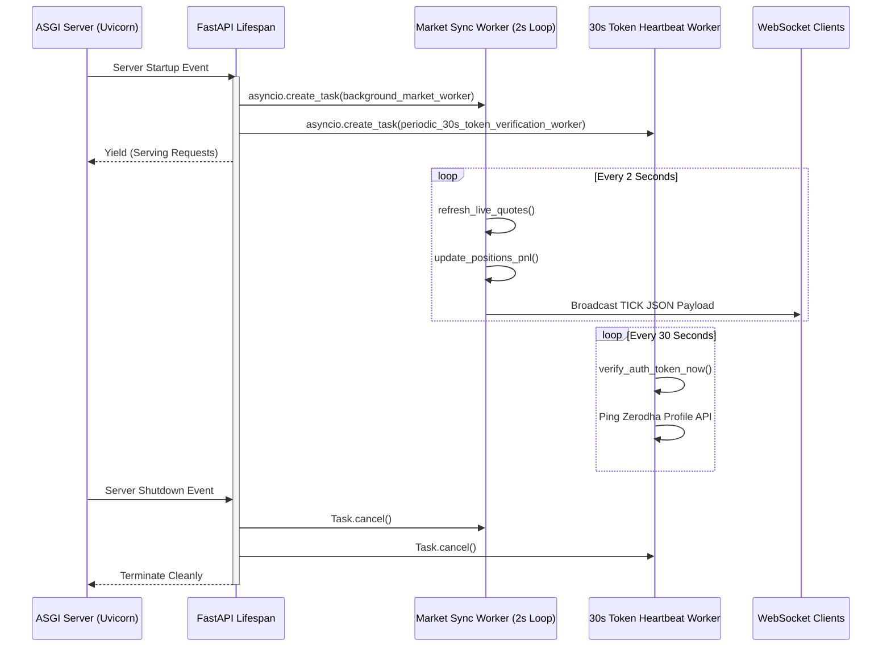

# KitePulse AI — Technical System Architecture & Engineering Design

This document details the architectural design, concurrency models, data flows, and security protocols implemented within **KitePulse AI**. It serves as the authoritative technical reference for system design reviews, audits, and architectural evaluations.

---

## 1. Architectural Principles & Patterns

The architecture of KitePulse AI is built upon proven software engineering principles:

```
+-----------------------------------------------------------------------------------+
|                              ARCHITECTURAL PATTERNS                               |
+--------------------------+----------------------------+---------------------------+
|      STRATEGY PATTERN    |      REPOSITORY PATTERN    |      ADAPTER PATTERN      |
| BaseOrderExecutor        | TradingRepository          | KiteExecutionEngine       |
| isolates Paper & Live    | isolates SQLite & ACID     | isolates Zerodha Kite SDK |
| execution behaviors      | persistence operations     | from core business logic  |
+--------------------------+----------------------------+---------------------------+
```

1. **Dependency Inversion Principle (DIP)**: High-level trading modules do not depend directly on low-level broker SDKs. Both depend on abstract contracts defined in `core.interfaces`.
2. **Single Responsibility Principle (SRP)**:
   - `MarketDataManager`: Handles quote ingestion and candle enrichment.
   - `GeminiMarketAnalyzer`: Generates trade proposals via LLM or quantitative math.
   - `UnifiedTradingEngine`: Manages position lifecycles, triggers, and order routing.
   - `TradingRepository`: Encapsulates database transactions and schema queries.
   - `server_logger`: Enforces audit logging and credential sanitization.
3. **Defense in Depth**: Zero plaintext credentials on disk, 30-second token verification heartbeats, constant-time hash comparisons, and strict execution guardrails.

---

## 2. Core Subsystems & Interfaces



### 2.1 Execution Strategy Layer
- **`PaperExecutionEngine`**: Implements realistic fill simulation, local balance updates, and isolated virtual position tracking without making external network calls.
- **`KiteExecutionEngine`**: Manages Zerodha KiteConnect SDK bindings, exchanges OAuth tokens, handles transaction types (`MIS` Intraday, `NSE` / `NFO`), and tracks order statuses.
- **`UnifiedTradingEngine`**: Orchestrates active strategy selection based on `settings.TRADING_MODE`, maintaining persistent position state and coordinating stop-loss / take-profit triggers.

---

## 3. Concurrency & Lifespan Architecture

KitePulse AI utilizes FastAPI's modern `lifespan` context manager, replacing deprecated event handlers with an asynchronous lifecycle pipeline:



### Concurrency Guarantees:
- **Non-blocking I/O**: Heavy synchronous computations (such as PBKDF2 hashing) are offloaded to worker threads via Starlette's threadpool.
- **Task Isolation**: Background polling routines run in detached `asyncio` tasks with structured error logging, preventing background exceptions from bubbling up to terminate the web server.

---

## 4. Cryptographic Security Vault

Credentials (Kite API Key/Secret, Access Token, Gemini API Key) are never stored in plaintext on disk or in version control:

```
[Master Password] ---> PBKDF2-HMAC-SHA256 (100k rounds, 16B Salt) ---> Hex Hash (auth_config table)
                                   |
                      Master Key Salt (16B Salt)
                                   |
                                   v
             [32-Byte Fernet Key Derived (In-Memory Only)]
                                   |
             +---------------------+---------------------+
             |                                           |
             v                                           v
[Plaintext API Secret]                       [Encrypted Ciphertext Token]
        |                                                |
        +---> Fernet AES-128-CBC + HMAC-SHA256 --------->+ (secure_vault table)
```

### Security Measures:
1. **Zero Plaintext Persistence**: If the database file (`trading.db`) is extracted, stored credentials cannot be decrypted without the user's master password.
2. **Volatile In-Memory Key**: The derived Fernet key (`_unlocked_encryption_key`) is maintained strictly in memory and wiped upon logout or server shutdown.
3. **Timing-Attack Resistance**: Master password verification employs `secrets.compare_digest` to prevent side-channel timing analysis.
4. **Log Redaction**: `RequestResponseLoggingMiddleware` and `server_logger` sanitize dictionary payloads, stripping sensitive fields (`password`, `api_secret`, `access_token`) before writing to the 3MB rotating log files.

---

## 5. Risk Management & Execution Guardrails

```
                                [Market Setup Scanned]
                                          |
                                          v
                              [AI / Quant Analysis]
                                          |
                                          v
                           +------------------------------+
                           |     TradeProposal Created    |
                           |  - lot_size = 1 (LOCKED)     |
                           |  - status = PENDING_APPROVAL |
                           |  - expires_in = 60 seconds   |
                           +------------------------------+
                                          |
                     +--------------------+--------------------+
                     |                                         |
          [Timeout > 60s OR Reject]                   [Human Confirms: 'Approve']
                     |                                         |
                     v                                         v
            {PROPOSAL DISCARDED}                      {EXECUTE ORDER}
                                                               |
                                            +------------------+------------------+
                                            |                                     |
                                     (PAPER MODE)                            (LIVE MODE)
                                            |                                     |
                                            v                                     v
                                 [PaperExecutionEngine]                 [Zerodha KiteConnect]
                                 Virtual fill @ LTP                     MIS Market Order routed
                                            |                                     |
                                            +------------------+------------------+
                                                               |
                                                               v
                                                    [Position Monitored (2s)]
                                                               |
                                            +------------------+------------------+
                                            |                                     |
                                     Current <= SL                         Current >= Target
                                            |                                     |
                                            v                                     v
                                    {TRIGGERED_SL}                        {TRIGGERED_TARGET}
                                    Auto Square-Off                       Auto Square-Off
```

### Safety Guardrail Breakdown:
1. **Strict 1-Lot Cap**: Enforces `min(proposal.lot_size, settings.MAX_LOT_SIZE)` where `MAX_LOT_SIZE = 1`. Eliminates the risk of oversized positions during system evaluation.
2. **60-Second Human Approval**: AI trade proposals are never executed automatically. The user must provide verbal confirmation ("Approve") or click the confirmation button within 60 seconds.
3. **Continuous Trailing SL / Target Triggers**: Positions are evaluated against incoming quotes every 2 seconds. When price action reaches or exceeds stop-loss or take-profit targets, an offsetting market order is routed immediately.
4. **30-Second Token Verification Heartbeat**: The system re-validates that the active session and outbound broker tokens are healthy before routing any live transaction.

---

## 6. Mathematical Foundations of Quantitative Indicators

All indicators in `technical_indicators.py` are vectorized via Pandas and NumPy:

### 6.1 Exponential Moving Average (EMA)
$$\alpha = \frac{2}{N + 1}$$
$$\text{EMA}_t = (\text{Price}_t \times \alpha) + (\text{EMA}_{t-1} \times (1 - \alpha))$$
*Periods used: 9 (fast momentum), 21 (intraday trend), 50 (macro support/resistance).*

### 6.2 Relative Strength Index (RSI)
$$\text{RS} = \frac{\text{SMA}(\text{Gains}, 14)}{\text{SMA}(\text{Losses}, 14)}$$
$$\text{RSI} = 100 - \left(\frac{100}{1 + \text{RS}}\right)$$
*Used to identify momentum divergences and overextended conditions (>70 overbought, <30 oversold).*

### 6.3 Volume Weighted Average Price (VWAP)
$$\text{Typical Price (TP)}_t = \frac{\text{High}_t + \text{Low}_t + \text{Close}_t}{3}$$
$$\text{VWAP}_t = \frac{\sum_{i=1}^t (\text{TP}_i \times \text{Volume}_i)}{\sum_{i=1}^t \text{Volume}_i}$$
*Serves as the benchmark for institutional intraday execution and directional bias.*

### 6.4 Average True Range (ATR)
$$\text{TR}_t = \max(\text{High}_t - \text{Low}_t, |\text{High}_t - \text{Close}_{t-1}|, |\text{Low}_t - \text{Close}_{t-1}|)$$
$$\text{ATR}_t = \text{SMA}(\text{TR}, 14)$$
*Determines dynamic stop-loss offsets and target projections adapted to current market volatility.*

### 6.5 Classic Floor Pivot Points
$$\text{PP} = \frac{\text{High} + \text{Low} + \text{Close}}{3}$$
$$\text{R1} = (2 \times \text{PP}) - \text{Low}, \quad \text{S1} = (2 \times \text{PP}) - \text{High}$$
$$\text{R2} = \text{PP} + (\text{High} - \text{Low}), \quad \text{S2} = \text{PP} - (\text{High} - \text{Low})$$

---

## 7. Database Architecture & Indexing

KitePulse AI operates an ACID-compliant SQLite embedded database utilizing **Write-Ahead Logging (WAL)**:

```sql
PRAGMA journal_mode = WAL;
PRAGMA busy_timeout = 30000;
```

### Key Schema Entities:
- **`trade_suggestions`**: Indexed on `proposal_id` (UNIQUE). Stores historical signals, confidence scores, verbal pitches, and technical rationales.
- **`positions`**: Indexed on `position_id` (UNIQUE) with foreign key referencing `proposal_id`. Stores entry price, current LTP, stop-loss, targets, and realized/unrealized P&L.
- **`orders`**: Indexed on `order_id` (UNIQUE). Immutable audit log capturing order types, quantities, fill prices, broker statuses, and execution timestamps.
- **`auth_config`**: Single-row configuration storing the PBKDF2 password hash, random salts, and initialization state.
- **`secure_vault`**: Key-value table storing Fernet-encrypted sensitive API credentials.

---

## 8. Frontend Terminal Architecture

The frontend is constructed using **React 19**, **TypeScript**, and **TradingView Lightweight Charts v5**:

- **Hardware Accelerated Rendering**: Candlesticks, volume bars, and EMA overlays render directly on HTML5 Canvas at 60 FPS.
- **State Synchronization**: WebSocket client maintains automatic reconnection with exponential backoff, updating quote cards and active positions mark-to-market.
- **Web Speech & Web Audio**: Integrates native browser speech recognition for hands-free command processing (`"Approve"`, `"Reject"`, `"Scan"`) and discrete synthesizer cues (`Office Mode`).

---

## 9. Enterprise Codebase Layout & Layering

### 9.1 REST Backend (`backend/`) — Layered Clean Architecture
```text
backend/
├── app/                        # Application Root Package
│   ├── main.py                 # FastAPI Application Factory & Lifespan Orchestrator
│   ├── config.py               # Pydantic BaseSettings & Dynamic Instrument Loaders
│   ├── core/                   # Cross-Cutting Infrastructure
│   │   ├── security.py         # Passwords, PBKDF2, Bearer tokens, vault
│   │   ├── logging.py          # Structured server logging & rotating file handlers
│   │   └── interfaces.py       # BaseOrderExecutor & BaseMarketDataProvider contracts
│   ├── api/                    # HTTP & WebSocket Delivery Layer
│   │   ├── deps.py             # Security Barrier & FastAPI Dependencies (require_auth)
│   │   └── v1/                 # Versioned API Routers
│   │       ├── router.py       # Aggregated v1 API Router
│   │       └── endpoints/      # Domain-specific route controllers
│   │           ├── auth.py     # /api/auth/*
│   │           ├── market.py   # /api/market/*
│   │           ├── trades.py   # /api/trade/* & /api/trades/*
│   │           ├── settings.py # /api/settings/* & /api/instruments
│   │           └── websocket.py# /ws/live
│   ├── models/                 # Data Layer
│   │   ├── database.py         # SQLite Schema, Connection Pool, Vault Persistence
│   │   └── schemas.py          # Pydantic Request/Response DTOs
│   ├── services/               # Domain Business Logic
│   │   ├── kite/               # Zerodha Kite SDK & Live Order Executor
│   │   ├── paper/              # Virtual Sandbox Engine
│   │   ├── market/             # Quotes Ingestion & Technical Indicators
│   │   ├── ai/                 # Gemini Quantitative Reasoning Engine
│   │   └── notifications/      # Multi-channel Webhook Dispatcher
│   └── data/                   # Configuration & Static Assets
│       └── instruments.json    # Configurable Trading Instruments
├── tests/                      # Pytest Automated Test Suite (17 Integration Tests)
├── logs/                       # Rotating Runtime Server Logs
├── requirements.txt
└── main.py                     # Root Backward-Compatibility Shim
```

### 9.2 Client Frontend (`frontend/src/`) — Feature-Driven Architecture
```text
frontend/src/
├── app/                        # App Entry & Providers
│   ├── App.tsx                 # Root Layout & State Composition
│   ├── App.css                 # Layout Styles
│   └── main.tsx                # DOM Bootstrap
├── core/                       # Foundational Styles & Design Tokens
│   └── styles/index.css
├── types/                      # TypeScript Interfaces (Quote, Candle, Order, etc.)
│   └── index.ts
├── services/                   # API & Infrastructure Client Layer
│   ├── api.ts                  # REST Client & HTTP Interceptors
│   ├── speech.ts               # Web Speech Synthesis & Recognition
│   ├── sound.ts                # Web Audio API Synthesizer
│   └── notifications.ts        # Browser Desktop Alerts
├── components/                 # Shared Components
│   └── layout/Header.tsx       # Top Bar & Connectivity Status
└── features/                   # Domain Features
    ├── auth/AuthGatekeeper.tsx # Master Password Vault Screen
    ├── market/                 # Watchlist & Real-Time TradingChart
    ├── trading/                # TradeProposalCard, PositionsTable, HistoryTracker
    ├── voice/VoiceRadar.tsx    # Hands-Free Voice Radar
    └── settings/SettingsModal.tsx # Credentials Vault Modal
```
